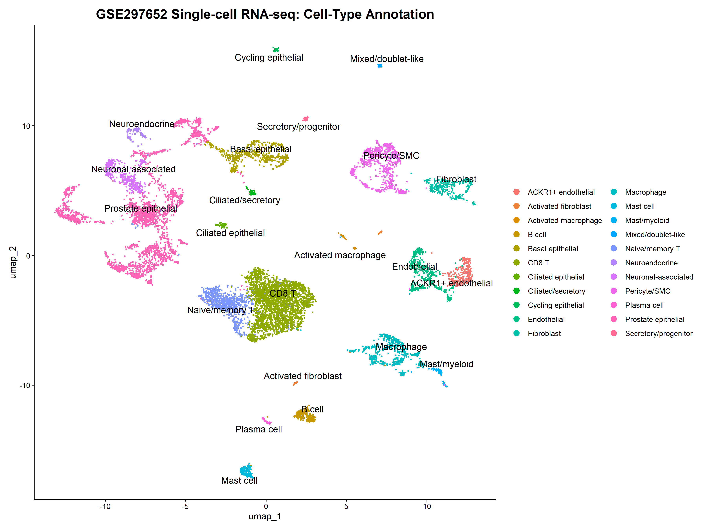
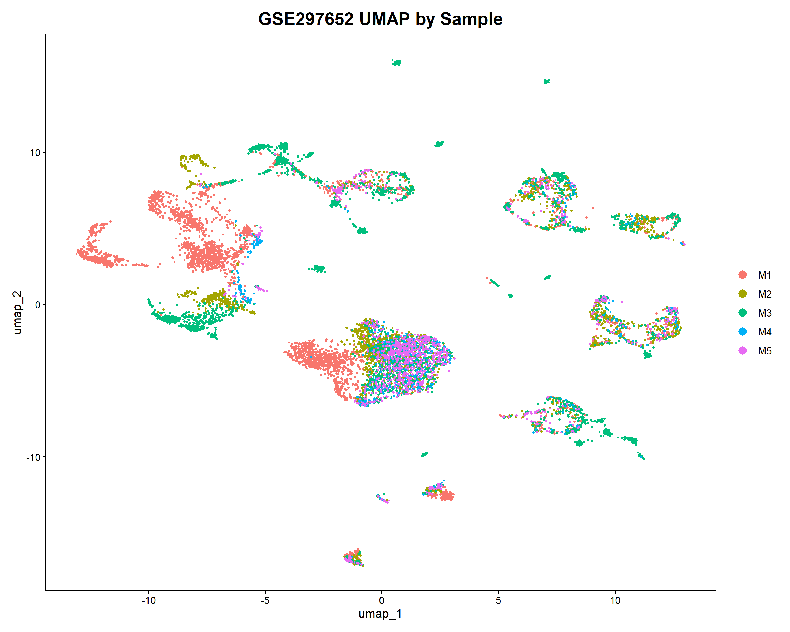
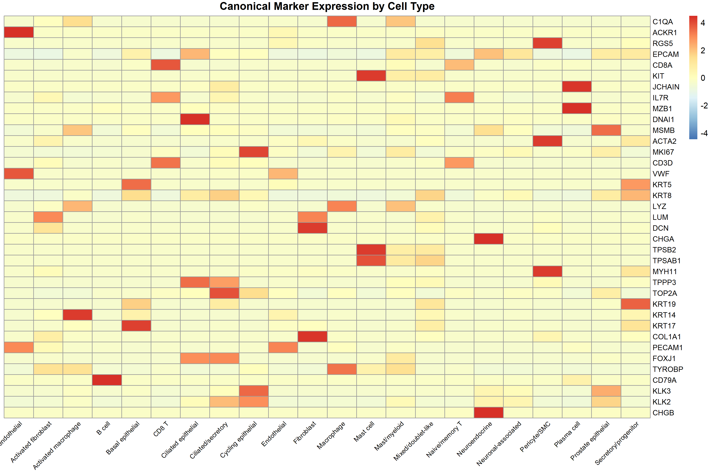
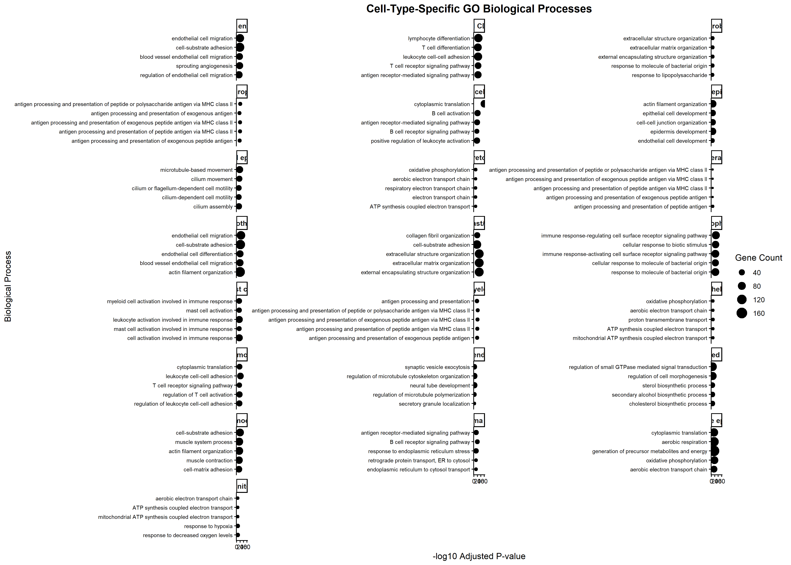
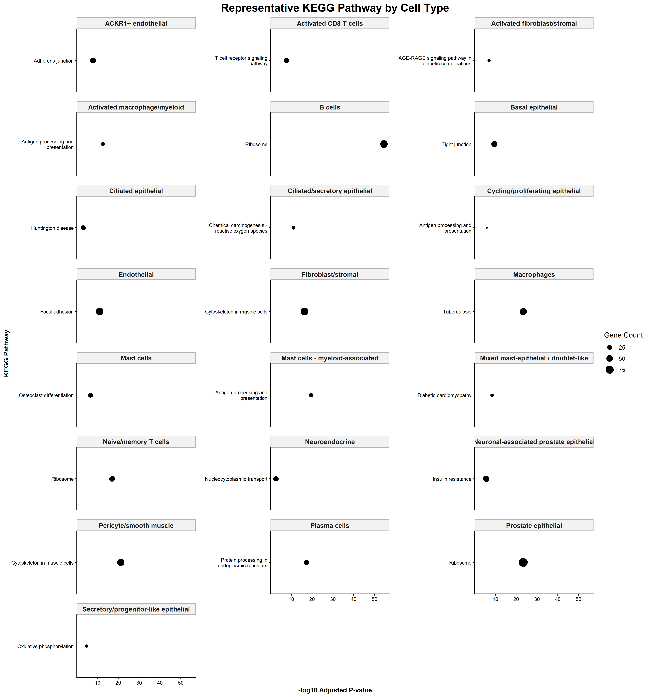

# Single-Cell RNA-seq Analysis of Prostate Cancer

Single-cell RNA-sequencing analysis of **GSE297652** using **Seurat**, including quality-control assessment, dimensionality reduction, clustering, cell-type annotation, marker identification, and functional enrichment analysis using **GO Biological Process** and **KEGG**.

## Project Overview

This project analyzes single-cell RNA-seq data from prostate cancer samples to characterize cellular heterogeneity and identify transcriptional and functional features associated with different cell populations.

The analysis integrates five samples (**M1–M5**) and identifies distinct cellular populations based on gene-expression profiles.

### Dataset

* **GEO accession:** GSE297652
* **Samples analyzed:** M1, M2, M3, M4, M5
* **Total cells:** 10,445
* **Genes:** 36,601
* **Analysis framework:** Seurat
* **Organism:** *Homo sapiens*

---

# Analysis Workflow

```text
GSE297652
    │
    ├── Raw 10X count matrices
    │
    ├── Metadata integration
    │
    ├── Quality Control
    │
    ├── Normalization
    │
    ├── Highly Variable Gene Selection
    │
    ├── Scaling
    │
    ├── PCA
    │
    ├── KNN/SNN Graph
    │
    ├── Clustering
    │
    ├── UMAP
    │
    ├── Marker Gene Identification
    │
    ├── Cell-Type Annotation
    │
    ├── GO Biological Process Enrichment
    │
    └── KEGG Pathway Enrichment
```

---

# 1. Data Preparation

Five filtered 10X Genomics expression matrices were processed:

* M1
* M2
* M3
* M4
* M5

Cell barcodes were matched against the accompanying GSE297652 metadata before constructing the Seurat objects.

The five sample-specific Seurat objects were subsequently merged into a single dataset containing:

**36,601 genes × 10,445 cells**

---

# 2. Quality Control

Quality-control metrics included:

* `nCount_RNA`
* `nFeature_RNA`
* mitochondrial RNA percentage

The QC distributions were examined using violin plots, feature scatter plots, and percentile analysis.

The observed ranges were:

| Metric          | Minimum | Median |  Mean | Maximum |
| --------------- | ------: | -----: | ----: | ------: |
| nCount_RNA      |     801 |  4,005 | 8,672 | 182,855 |
| nFeature_RNA    |     501 |  1,780 | 2,418 |  12,236 |
| Mitochondrial % |       0 |   3.61 |  4.11 |    9.99 |

Potential QC thresholds were also evaluated.

Because only a small number of cells were affected by the examined high-count/high-feature thresholds and mitochondrial percentages remained below 10%, **all 10,445 cells were retained for downstream analysis**.

---

# 3. Normalization and Feature Selection

Expression data were normalized using Seurat's:

```r
NormalizeData(
    normalization.method = "LogNormalize",
    scale.factor = 10000
)
```

Highly variable genes were identified using the **VST method**, selecting:

**2,000 highly variable genes**

The variable-gene set was checked for mitochondrial, ribosomal, and `MALAT1` enrichment.

The selected highly variable genes did not contain mitochondrial genes, ribosomal genes, or `MALAT1`.

---

# 4. Dimensionality Reduction

The 2,000 highly variable genes were scaled and analyzed using PCA.

* **50 principal components** were calculated.
* The first **20 PCs** were used for neighborhood graph construction, clustering, and UMAP.

```r
FindNeighbors(
    seurat_combined,
    dims = 1:20
)

FindClusters(
    seurat_combined,
    resolution = 0.5
)

RunUMAP(
    seurat_combined,
    dims = 1:20
)
```

The analysis identified:

**27 transcriptional clusters**

---

# 5. Cell-Type Annotation

Cluster identities were assigned using:

* Cluster marker genes
* Canonical lineage markers
* Dot plots
* Feature plots
* Marker-expression heatmaps
* Investigation of ambiguous clusters

The analysis resulted in **22 annotated cell populations**.

| Cell Type                               | Cells | Percentage |
| --------------------------------------- | ----: | ---------: |
| Activated CD8 T cells                   | 2,632 |     25.20% |
| Prostate epithelial                     | 2,473 |     23.68% |
| Naive/memory T cells                    |   840 |      8.04% |
| Pericyte/smooth muscle                  |   735 |      7.04% |
| Macrophages                             |   586 |      5.61% |
| Basal epithelial                        |   571 |      5.47% |
| Endothelial                             |   494 |      4.73% |
| Neuronal-associated prostate epithelial |   421 |      4.03% |
| Fibroblast/stromal                      |   336 |      3.22% |
| ACKR1+ endothelial                      |   270 |      2.58% |
| B cells                                 |   223 |      2.13% |
| Mast cells                              |   169 |      1.62% |
| Neuroendocrine                          |    98 |      0.94% |
| Mast cells - myeloid-associated         |    92 |      0.88% |
| Activated fibroblast/stromal            |    74 |      0.71% |
| Ciliated epithelial                     |    71 |      0.68% |
| Ciliated/secretory epithelial           |    68 |      0.65% |
| Activated macrophage/myeloid            |    66 |      0.63% |
| Plasma cells                            |    64 |      0.61% |
| Cycling/proliferating epithelial        |    60 |      0.57% |
| Secretory/progenitor-like epithelial    |    59 |      0.56% |
| Mixed mast-epithelial / doublet-like    |    43 |      0.41% |

---

# 6. Marker Gene Analysis

Cluster-specific marker genes were identified using:

```r
FindAllMarkers(
    only.pos = TRUE,
    min.pct = 0.25,
    logfc.threshold = 0.25
)
```

Cell-type marker sets were subsequently filtered using:

* Adjusted p-value < 0.05
* Average log2 fold-change > 0.5

Canonical markers were used to validate major populations.

Examples include:

| Population             | Representative markers        |
| ---------------------- | ----------------------------- |
| T cells                | CD3D, CD3E, CD8A, CCL5        |
| B cells                | CD19, CD79A, MS4A1            |
| Plasma cells           | JCHAIN, MZB1                  |
| Macrophages            | LYZ, TYROBP, C1QA, C1QB, C1QC |
| Mast cells             | TPSAB1, TPSB2, CPA3, KIT      |
| Endothelial            | PECAM1, VWF, EMCN, KDR        |
| ACKR1+ endothelial     | ACKR1                         |
| Fibroblast/stromal     | COL1A1, COL1A2, DCN, LUM      |
| Pericyte/smooth muscle | RGS5, MCAM, ACTA2, MYH11      |
| Prostate epithelial    | KLK2, KLK3, MSMB, ACPP        |
| Ciliated epithelial    | FOXJ1, TPPP3, DNAI1, CCNO     |
| Neuroendocrine         | CHGA, CHGB, SCG3, SYP         |
| Cycling cells          | MKI67, TOP2A, CDK1, AURKB     |

---

# 7. Ambiguous Cluster Investigation

Three clusters required additional examination:

* Cluster 17
* Cluster 19
* Cluster 26

Additional cell-level marker co-expression analyses were performed.

### Cluster 17

This population showed mast-cell and myeloid-associated expression patterns and was annotated as:

**Mast cells - myeloid-associated**

### Cluster 19

This population showed strong ciliated-cell markers including:

* `DNAI1`
* `CCNO`
* `FOXJ1`
* `TPPP3`

and was annotated as:

**Ciliated epithelial**

### Cluster 26

This small population showed co-expression of mast-cell and epithelial markers.

It was therefore conservatively annotated as:

**Mixed mast-epithelial / doublet-like**

The annotation does **not** claim that every cell in this cluster is definitively a doublet.

---

# 8. Functional Enrichment Analysis

Functional enrichment was performed separately for each annotated cell type.

## GO Biological Process

GO Biological Process enrichment was performed using:

* `clusterProfiler`
* `org.Hs.eg.db`
* Benjamini-Hochberg correction
* Background consisting of genes tested in the dataset

The analysis identified cell-type-associated biological processes, including processes related to:

* immune activation
* extracellular matrix organization
* cell adhesion
* endothelial migration
* T-cell activation
* epithelial development
* cilium movement
* muscle-related processes
* antigen processing and presentation
* cellular respiration

## KEGG Pathway Analysis

KEGG enrichment was also performed for each cell type.

Examples of enriched pathways included:

* T-cell receptor signaling
* Natural killer cell-mediated cytotoxicity
* B-cell receptor signaling
* Phagocytosis
* Focal adhesion
* Integrin signaling
* Rap1 signaling
* Adherens junction
* Antigen processing and presentation
* Oxidative phosphorylation

Generic pathways such as ribosome and oxidative phosphorylation were retained where statistically enriched rather than being interpreted as cell-type-exclusive pathways.

---

# 9. Main Results

The analysis identified substantial cellular heterogeneity across the five samples.

The largest populations were:

* Activated CD8 T cells
* Prostate epithelial cells
* Naive/memory T cells
* Pericyte/smooth muscle cells
* Macrophages
* Basal epithelial cells

The cell-type composition also varied between samples.

For example, the sample-level analysis showed different relative proportions of immune, epithelial, endothelial, stromal, and other populations across M1–M5.

Functional enrichment analysis further demonstrated distinct biological-process and pathway signatures across the annotated cell populations.

---

# 10. Figures

### Cell-Type Annotation



### UMAP by Sample



### Canonical Marker Heatmap



### GO Biological Process Enrichment



### KEGG Pathway Enrichment



---

# 11. Results Tables

The `results/tables/` directory contains:

* Final integrated cell-type results
* Cluster marker results
* Top cluster markers
* Cell-type marker results
* Cell-type composition by sample
* GO enrichment results
* Top GO terms
* KEGG enrichment results
* Top KEGG pathways

---

# 12. Repository Structure

```text
SingleCell-RNAseq-Prostate-Cancer/
│
├── README.md
│
├── scripts/
│   └── editedscript.R
│
├── results/
    ├── figures/
    │   ├── GSE297652_final_annotated_UMAP.png
    │   ├── GSE297652_UMAP_by_sample.png
    │   ├── GSE297652_final_marker_heatmap.png
    │   ├── GSE297652_celltype_GO_enrichment_FINAL.png
    │   └── GSE297652_representative_KEGG_pathway_FINAL.png
    │
    └── tables/
        ├── GSE297652_FINAL_integrated_results_table.csv
        ├── GSE297652_integrated_celltype_summary.csv
        ├── GSE297652_cluster_markers.csv
        ├── GSE297652_top10_cluster_markers.csv
        ├── GSE297652_cluster_marker_summary.csv
        ├── GSE297652_top10_celltype_markers.csv
        ├── GSE297652_celltype_counts_by_sample.csv
        ├── GSE297652_celltype_percent_by_sample.csv
        ├── GSE297652_GO_enrichment_by_cell_type.csv
        ├── GSE297652_top10_GO_terms_by_cell_type.csv
        ├── GSE297652_top5_GO_terms_by_cell_type.csv
        ├── GSE297652_KEGG_enrichment_by_cell_type.csv
        └── GSE297652_top5_KEGG_pathways_by_cell_type.csv


```

---

# 13. Software and Packages

The analysis was performed using:

* R 4.5.3
* Seurat 5.5.1
* Matrix 1.7.4
* data.table
* ggplot2
* dplyr
* stringr
* pheatmap
* clusterProfiler
* org.Hs.eg.db

---

# 14. Reproducibility

The complete analysis workflow is provided in:

```text
scripts/Single cell RNA-Seq script.R
```

The script covers:

1. Data loading
2. Metadata integration
3. Seurat object creation
4. Quality-control assessment
5. Normalization
6. Variable-feature selection
7. Scaling
8. PCA
9. Clustering
10. UMAP
11. Marker identification
12. Cell-type annotation
13. Marker validation
14. GO enrichment
15. KEGG enrichment
16. Integrated result generation


---

# Conclusion

This project demonstrates an end-to-end single-cell RNA-seq analysis workflow using Seurat, from raw 10X expression matrices and metadata through clustering, cell-type annotation, marker characterization, and functional enrichment analysis.

The resulting portfolio includes reproducible analysis code, publication-style visualizations, and structured result tables for downstream interpretation.

---
